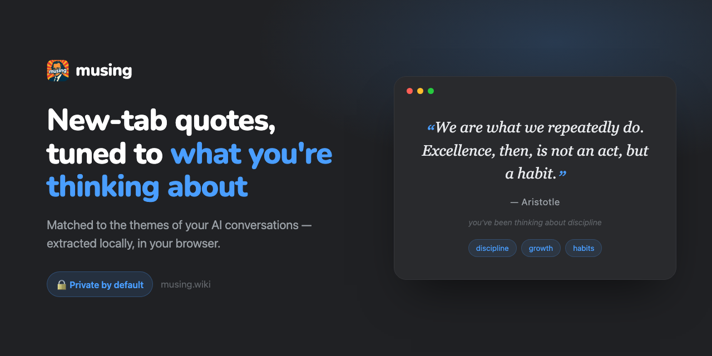

<div align="center">


# Musing

**Your new tab, matched to what you have been thinking about.**

Musing turns every new tab into a piece of historical wisdom, chosen from the themes of your recent AI conversations — extracted locally, in your browser.

[](https://chromewebstore.google.com/detail/hkfpdamehcnbhfeilamlbeabgdlgnjfk)
[](https://chromewebstore.google.com/detail/hkfpdamehcnbhfeilamlbeabgdlgnjfk)
[](https://github.com/PGHQdev/musing/actions/workflows/ci.yml)
[](LICENSE)


<a href="https://chromewebstore.google.com/detail/hkfpdamehcnbhfeilamlbeabgdlgnjfk"><b>Install from the Chrome Web Store →</b></a>

<br>



</div>

## Why

Your most honest record of what you care about is no longer your browsing history — it is your conversations with AI. Musing reads the themes of those conversations and answers each new tab with a relevant quote from history's thinkers. All of the matching happens on your device.

## Features

- **Context-aware quotes** — a bundled database of 93 quotes across 27 themes, matched to the topics you have been discussing.
- **Local by default** — theme extraction is keyword matching inside the extension. No account, no backend, no network request to open a tab.
- **Works across Claude, ChatGPT, and Gemini** — one shared capture core reads lightweight, sanitized context from each site.
- **"Less like this"** — block a theme and it drops out of both matching and future extraction.
- **Optional Smart Reasons (BYOK)** — add your own Groq, Anthropic, or OpenAI key to get an AI-written line on why a quote fits. Off by default; the request goes straight from your browser to your provider.
- **Optional browser-history themes** — opt in to extract themes from history too; sensitive hosts (email, banking, health) are skipped.
- **Daily quote, favorites, anti-repeat, and one-click copy.**

## How it works

```
┌─ claude.ai / chatgpt.com / gemini.google.com ─┐
│  content script (shared capture-core)          │  sanitized snippets + titles
└───────────────────────────────┬────────────────┘
                                 ▼
                    background service worker
              local theme extraction  →  quote match
                                 ▼
                    chrome.storage.local (cache)
                                 ▼
                     new tab  →  instant quote
                     (optional) BYOK Smart Reason
```

1. Content scripts read lightweight, sanitized context on the three AI sites.
2. The background worker extracts themes locally and matches quotes from the bundled database.
3. The new tab shows a cached quote immediately, with a short reason.
4. If Smart Reasons is enabled, the reason is generated by your chosen provider, using your key, from your browser.

See [CONTEXT.md](CONTEXT.md) for the domain glossary and architecture notes.

## Install

### From the Chrome Web Store

[Install Musing](https://chromewebstore.google.com/detail/hkfpdamehcnbhfeilamlbeabgdlgnjfk) — the recommended path for most users.

### From source

```bash
git clone https://github.com/PGHQdev/musing.git
```

1. Open `chrome://extensions/`.
2. Enable **Developer mode** (top right).
3. Click **Load unpacked** and select the `extension/` folder.

To build the store package: `./scripts/zip-extension.sh` writes `dist/musing-v<version>.zip`.

## Privacy

- **Local by default.** Theme extraction and quote matching run entirely in your browser. The extension makes no server calls of its own and contains no analytics or tracking code.
- **Smart Reasons is the only outbound path, and it is opt-in.** When you enable it and add your own API key, small conversation-derived snippets go directly from your browser to the provider you chose (Groq, Anthropic, or OpenAI), under that provider's privacy policy, and only then.
- **Browser-history themes are opt-in** and require the `history` permission; sensitive hosts are excluded.

This describes the extension. The [landing page](https://musing.wiki) uses privacy-focused, cookieless analytics, disclosed in its [privacy policy](landing/privacy.html).

## Tech stack

Vanilla JavaScript, Chrome Manifest V3 (service worker), `chrome.storage.local`. No framework, no build step for the extension. Capture runs two ways: a shared DOM-scraping core and a `fetch`/XHR interceptor for structured responses.

## Project structure

| Path | What it is |
|------|------------|
| `extension/` | The Chrome extension (this is what ships). |
| `landing/` | Marketing site + its Cloudflare Worker. |
| `scripts/` | `zip-extension.sh`, the store packager. |
| `store-assets/` | Screenshot/tile templates and the rendered store images. |

## Customizing quotes

Edit [`extension/data/quotes.json`](extension/data/quotes.json) to add or change quotes. Each entry is tagged with one or more `themes`.

## Contributing

Issues and pull requests are welcome. See [CONTRIBUTING.md](CONTRIBUTING.md) and the [Code of Conduct](CODE_OF_CONDUCT.md). To report a security issue, see [SECURITY.md](SECURITY.md).

## License

[MIT](LICENSE) © pghqdev
